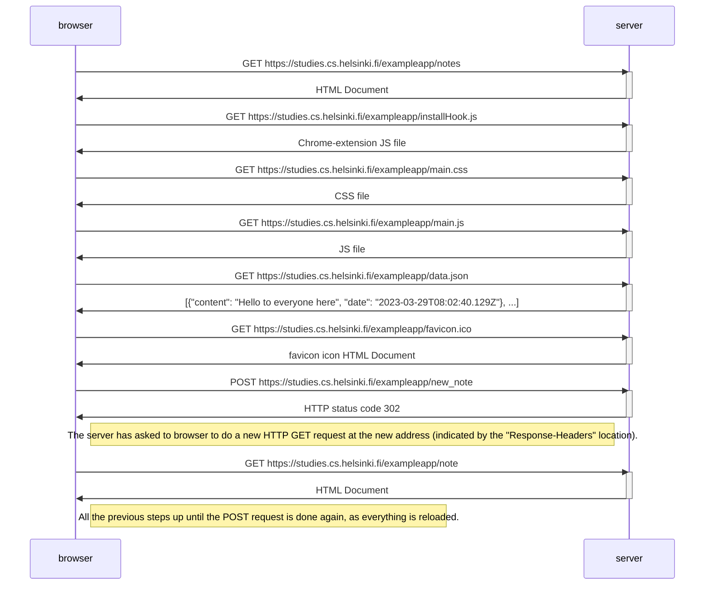

```mermaid
sequenceDiagram
	participant browser
	participant server
	
	browser->>server: GET https://studies.cs.helsinki.fi/exampleapp/notes
	activate server
	server->>browser: HTML Document
	deactivate server
	
	browser->>server: GET https://studies.cs.helsinki.fi/exampleapp/installHook.js
	activate server
	server->>browser: Chrome-extension JS file
	deactivate server
	
	
	browser->>server: GET https://studies.cs.helsinki.fi/exampleapp/main.css
	activate server
	server->>browser: CSS file
	deactivate server
	
	browser->>server: GET https://studies.cs.helsinki.fi/exampleapp/main.js
	activate server
	server->>browser: JS file
	deactivate server

	browser->>server: GET https://studies.cs.helsinki.fi/exampleapp/data.json
	activate server
	server->>browser: [{"content": "Hello to everyone here", "date": "2023-03-29T08:02:40.129Z"}, ...]
	deactivate server

	
	browser->>server: GET https://studies.cs.helsinki.fi/exampleapp/favicon.ico
	activate server
	server->>browser: favicon icon HTML Document
	deactivate server

	browser->>server: POST https://studies.cs.helsinki.fi/exampleapp/new_note
	activate server
	server->>browser: HTTP status code 302
	deactivate server

	Note right of browser: The server has asked to browser to do a new HTTP GET request at the new address (indicated by the "Response-Headers" location).

	browser->>server: GET https://studies.cs.helsinki.fi/exampleapp/note
	activate server
	server->>browser: HTML Document
	deactivate server
	
	Note right of browser: All the previous steps up until the POST request is done again, as everything is reloaded.
```