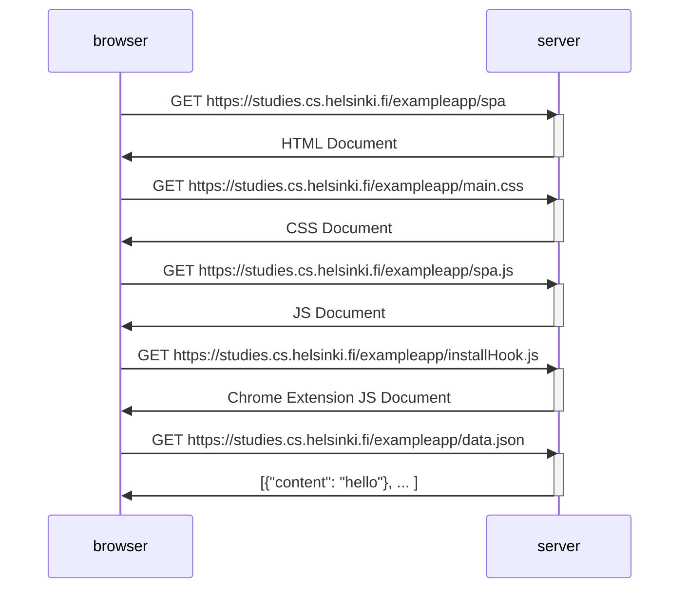

```mermaid
sequenceDiagram
	participant browser
	participant server
	
	browser->>server: GET https://studies.cs.helsinki.fi/exampleapp/spa
	activate server
	server->>browser: HTML Document
	deactivate server
	
	browser->>server: GET https://studies.cs.helsinki.fi/exampleapp/main.css
	activate server
	server->>browser: CSS Document
	deactivate server
	
	browser->>server: GET https://studies.cs.helsinki.fi/exampleapp/spa.js
	activate server
	server->>browser: JS Document
	deactivate server
	
	browser->>server: GET https://studies.cs.helsinki.fi/exampleapp/installHook.js
	activate server
	server->>browser: Chrome Extension JS Document
	deactivate server

	browser->>server: GET https://studies.cs.helsinki.fi/exampleapp/data.json
	activate server
	server->>browser: [{"content": "hello"}, ... ]
	deactivate server

``` 