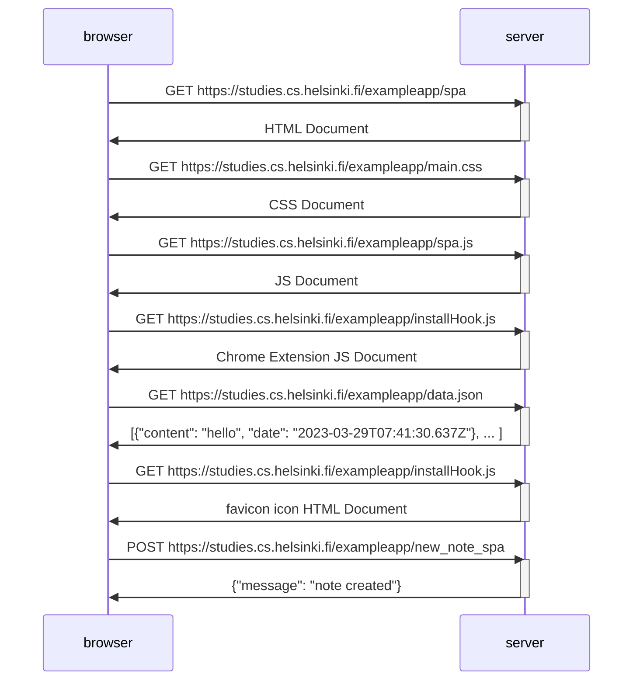

```mermaid
sequenceDiagram
	participant browser
	participant server
	
	browser->>server: GET https://studies.cs.helsinki.fi/exampleapp/spa
	activate server
	server->>browser: HTML Document
	deactivate server
	
	browser->>server: GET https://studies.cs.helsinki.fi/exampleapp/main.css
	activate server
	server->>browser: CSS Document
	deactivate server
	
	browser->>server: GET https://studies.cs.helsinki.fi/exampleapp/spa.js
	activate server
	server->>browser: JS Document
	deactivate server
	
	browser->>server: GET https://studies.cs.helsinki.fi/exampleapp/installHook.js
	activate server
	server->>browser: Chrome Extension JS Document
	deactivate server

	browser->>server: GET https://studies.cs.helsinki.fi/exampleapp/data.json
	activate server
	server->>browser: [{"content": "hello", "date": "2023-03-29T07:41:30.637Z"}, ... ]
	deactivate server

	browser->>server: GET https://studies.cs.helsinki.fi/exampleapp/installHook.js
	activate server
	server->>browser: favicon icon HTML Document
	deactivate server

	browser->>server: POST https://studies.cs.helsinki.fi/exampleapp/new_note_spa
	activate server
	server->>browser: {"message": "note created"}
	deactivate server
``` 